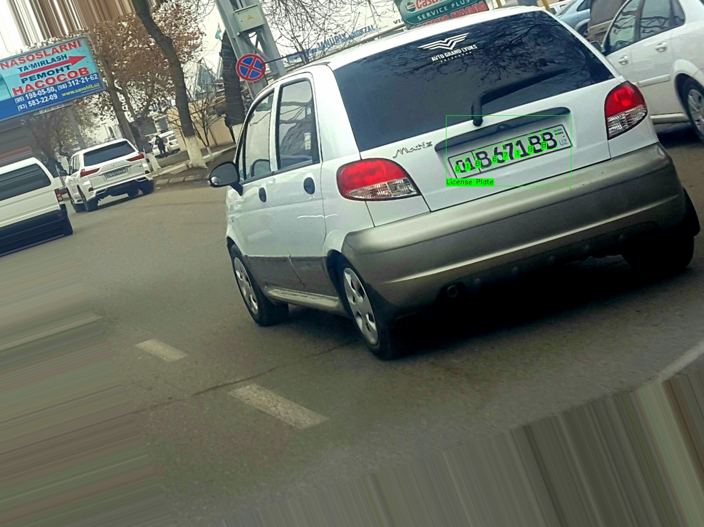

# YOLOv5_UZB_ALPR

This project develops a dataset and a YOLO-based model for automatic license plate recognition in Uzbekistan. Unlike existing solutions that require specific conditions, our approach adapts to Uzbekistan’s diverse plate formats and variable information layouts, making it effective for real-world applications in intelligent transportation systems.

# License Plate Detection with YOLOv5

This repository provides scripts for training, evaluating, and testing a YOLOv5 model for license plate detection. It includes tools for computing performance metrics (mAP, precision, recall, and F1 score) and options for saving predictions.

## Features
- **Training**: Train YOLOv5 on a custom dataset with configurable hyperparameters.
- **Evaluation**: Compute metrics like mAP, precision, recall, and F1 score.
- **Testing**: Perform inference on images and save predictions in multiple formats.

## Requirements

- **Python 3.6+**
- **PyTorch**
- **OpenCV**
- **NumPy**
- **TQDM**

## Directory Structure

Organize files as follows:
├── Dataset │ ├── PlateUZ │ │ ├── images # Image folder │ │ ├── labels # XML label folder │ │ └── train.txt # List of training images └── weights └── best.pt # Trained model weights


## Training
To train the model, use `train.py`:
```bash
python train.py --data data/coco.yaml --cfg models/yolov5x.yaml --weights weights/yolov5x.pt --batch-size 2 --epochs 300

## Evaluation
To evaluate performance on validation data, use evaluate.py:
python evaluate.py --weights weights/best.pt --data data/coco.yaml --img-size 640 --conf-thres 0.25 --iou-thres 0.5

## Testing
For inference and saving predictions:
python test.py --weights weights/yolov5s.pt --data data/coco128.yaml --batch-size 32 --img-size 640




## Configuration
Classes: Define the class labels in CLASSES (e.g., numbers, letters, "License Plate").
Paths: Set base_path to the dataset location.
Hyperparameters: Configure in YAML files (e.g., hyp.yaml).
